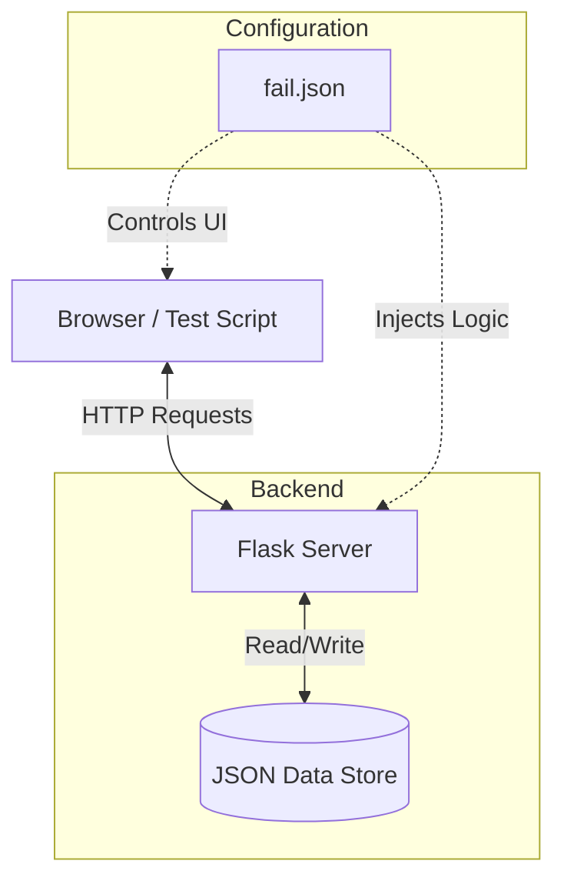
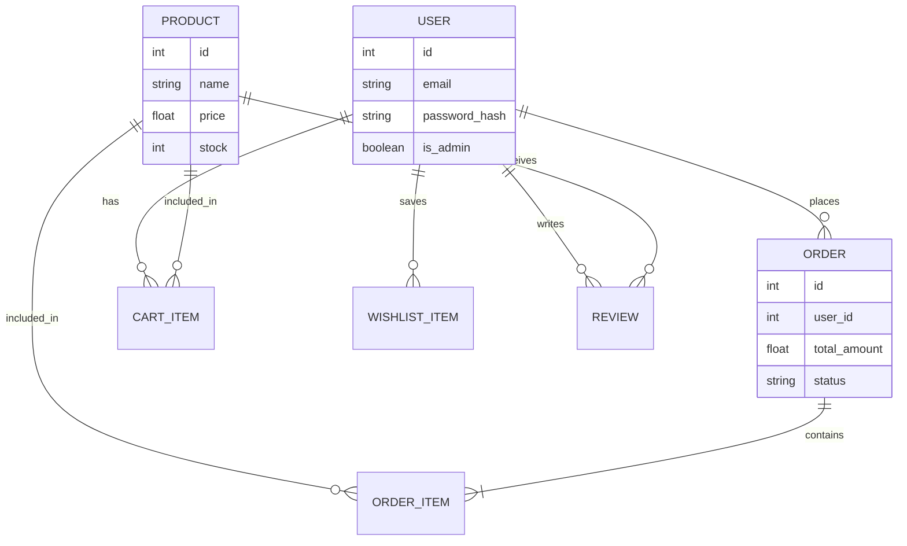
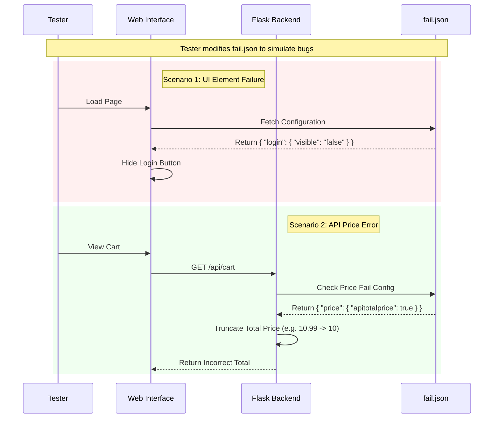
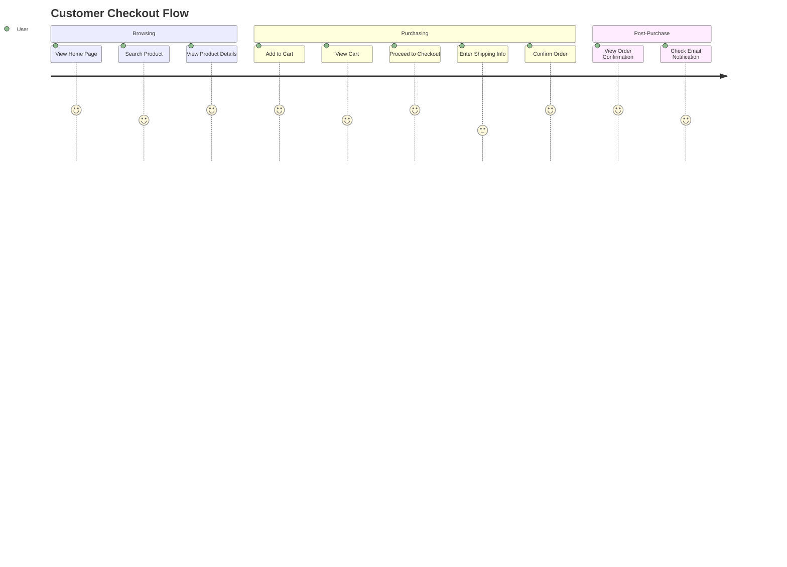
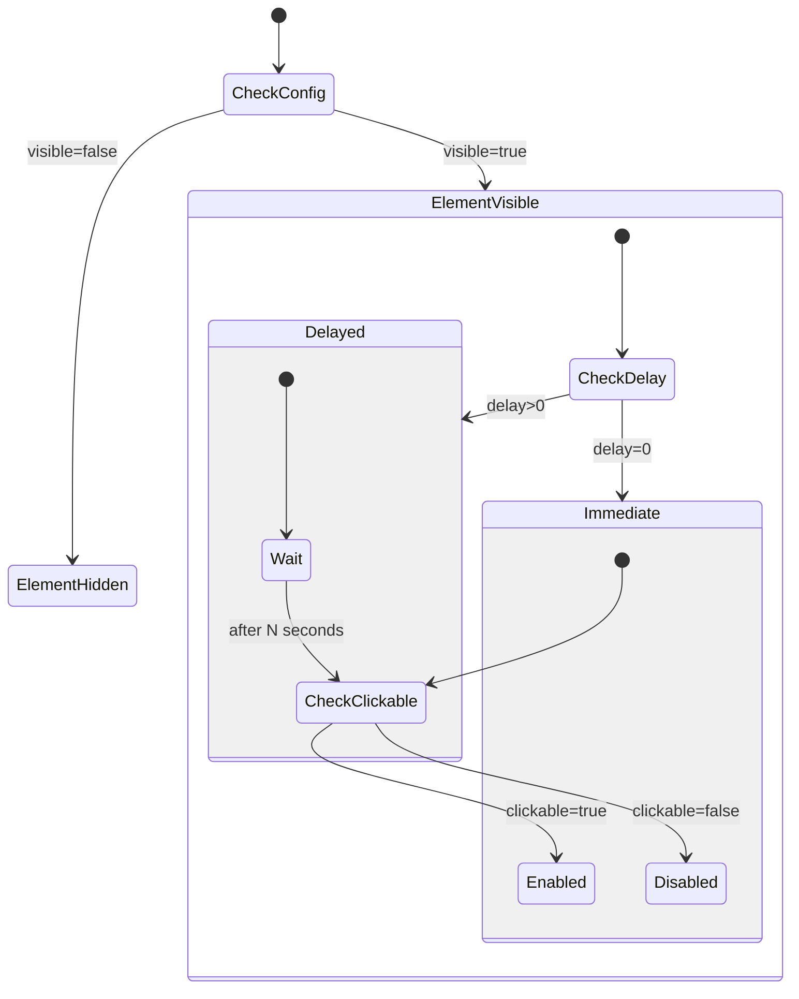

# Python Flask E-Commerce for Testing


A comprehensive E-Commerce application built with Python Flask, specifically designed for **API Testing** and **UI Automation** practice. This project includes a unique "Failure Injection" system to simulate real-world bugs and edge cases.

## 🎯 Project Purpose

This application serves as a **Test Object** for QA Engineers and SDETs to practice:
-   **API Testing:** RESTful endpoints with JWT authentication, CRUD operations, and complex business logic.
-   **UI Automation:** A responsive web interface with various interactive elements (forms, modals, dynamic content).
-   **Bug Reporting & Debugging:** Built-in mechanism to simulate flaky tests and system failures.

## ✨ Key Features

### 🛍️ E-Commerce Functionality
-   **User Management:** Registration, Login, Profile Management, Password Hashing.
-   **Product Catalog:** Search, Filter (Category, Price), Pagination, Product Details.
-   **Shopping Experience:** Cart Management, Wishlist, Checkout, Order History.
-   **Social Features:** Product Reviews, Likes, Helpful Votes on FAQs.
-   **Customer Support:** Help Center (FAQ), Contact Form, Admin Response System.
-   **Marketing:** Coupon System (Percentage/Fixed discounts), Notifications.
-   **Analytics:** Admin Dashboard with Sales Reports and User Activity.

### 🛠️ Technical Stack
-   **Backend:** Python Flask
-   **Database:** JSON-based flat files (No SQL setup required, easy to reset)
-   **Authentication:** JWT (JSON Web Tokens) with Access and Refresh tokens
-   **Frontend:** HTML5, CSS3, Vanilla JavaScript

## 🚀 Setup Instructions

### Prerequisites
-   Python 3.x installed

### Installation
1.  Clone the repository or download the source code.
2.  Navigate to the project directory:
    ```bash
    cd The-Test-Object
    ```
3.  Install dependencies:
    ```bash
    pip install -r requirements.txt
    ```

### Running the Application
1.  Start the Flask server:
    ```bash
    python app.py
    ```
2.  Access the application in your browser at:
    `http://127.0.0.1:5000`

## 🧪 The `fail.json` Feature (For Testers)

The most unique feature of this project is the **Failure Injection System**, controlled by `data/fail.json`. This allows you to simulate bugs without changing the source code, making it perfect for testing your automation scripts' resilience.

### How it Works
Modify `data/fail.json` to change the behavior of the application.

### Configuration Options

#### 1. UI Element Control
You can control the **Visibility**, **Clickability**, and **Delay** of key UI buttons.

```json
"addtocart": {
    "clickable": "false",   // Button becomes unclickable (simulates disabled state bug)
    "visible": "true",      // Button remains visible
    "visiabledelay": "5"    // Button appears after 5 seconds (simulates slow loading/latency)
}
```

**Supported Elements:**
-   `addtocart`
-   `cancelorder`
-   `checkout`
-   `login`
-   `register`
-   `search`
-   `wishlist`
-   `like`

#### 2. API Logic Failure
You can simulate backend calculation errors.

```json
"price": {
    "apitotalprice": true,   // Simulates integer truncation error (e.g., 10.99 becomes 10)
    "uitotalprice": false
}
```

### Benefits for Testers
-   **Practice Flaky Tests:** Use `visiabledelay` to test your explicit waits and synchronization strategies.
-   **Negative Testing:** Use `clickable: "false"` to verify your test handles disabled elements correctly.
-   **Bug Reproduction:** Simulate specific states to practice writing bug reports.
-   **Resilience Testing:** Verify if your automation suite fails gracefully when elements are missing or broken.

## 📚 API Documentation

The project comes with a comprehensive Postman collection and user stories.
-   **User Stories:** See `API_USER_STORY.md` for detailed requirements.
-   **Postman Collection:** Import `ITI E-Commerce API Online V30.postman_collection.json` into Postman.

### Key Endpoints
-   **Auth:** `POST /api/register`, `POST /api/login`, `POST /api/refresh`
-   **Products:** `GET /api/products`, `GET /api/products/{id}`
-   **Cart:** `GET /api/cart`, `POST /api/cart/items`
-   **Orders:** `POST /api/orders`, `GET /api/orders`

## 🧪 Testing Framework Demo
Visit `/test-framework` (e.g., `http://127.0.0.1:5000/test-framework`) to see a live demo of how `fail.json` affects UI elements.

## � System Visualizations

### 1. System Architecture


### 2. Database Schema (JSON Relationships)


### 3. Failure Injection Workflow


### 4. User Journey (Happy Path)


### 5. UI State Logic (fail.json)
```mermaid
stateDiagram-v2
    [*] --> CheckConfig
    CheckConfig --> ElementVisible: visible=true
    CheckConfig --> ElementHidden: visible=false
    
    state ElementVisible {
        [*] --> CheckDelay
        CheckDelay --> Immediate: delay=0
        CheckDelay --> Delayed: delay>0
        
        state Immediate {
            [*] --> CheckClickable
            CheckClickable --> Enabled: clickable=true
            CheckClickable --> Disabled: clickable=false
        }
        
        state Delayed {
            [*] --> Wait
```bash
pip install -r requirements.txt
```

### Running the Application
1.  Start the Flask server:
    ```bash
    python app.py
    ```
2.  Access the application in your browser at:
    `http://127.0.0.1:5000`

## 🧪 The `fail.json` Feature (For Testers)

The most unique feature of this project is the **Failure Injection System**, controlled by `data/fail.json`. This allows you to simulate bugs without changing the source code, making it perfect for testing your automation scripts' resilience.

### How it Works
Modify `data/fail.json` to change the behavior of the application.

### Configuration Options

#### 1. UI Element Control
You can control the **Visibility**, **Clickability**, and **Delay** of key UI buttons.

```json
"addtocart": {
    "clickable": "false",   // Button becomes unclickable (simulates disabled state bug)
    "visible": "true",      // Button remains visible
    "visiabledelay": "5"    // Button appears after 5 seconds (simulates slow loading/latency)
}
```

**Supported Elements:**
-   `addtocart`
-   `cancelorder`
-   `checkout`
-   `login`
-   `register`
-   `search`
-   `wishlist`
-   `like`

#### 2. API Logic Failure
You can simulate backend calculation errors.

```json
"price": {
    "apitotalprice": true,   // Simulates integer truncation error (e.g., 10.99 becomes 10)
    "uitotalprice": false
}
```

### Benefits for Testers
-   **Practice Flaky Tests:** Use `visiabledelay` to test your explicit waits and synchronization strategies.
-   **Negative Testing:** Use `clickable: "false"` to verify your test handles disabled elements correctly.
-   **Bug Reproduction:** Simulate specific states to practice writing bug reports.
-   **Resilience Testing:** Verify if your automation suite fails gracefully when elements are missing or broken.

## 📚 API Documentation

The project comes with a comprehensive Postman collection and user stories.
-   **User Stories:** See `API_USER_STORY.md` for detailed requirements.
-   **Postman Collection:** Import `ITI E-Commerce API Online V30.postman_collection.json` into Postman.

### Key Endpoints
-   **Auth:** `POST /api/register`, `POST /api/login`, `POST /api/refresh`
-   **Products:** `GET /api/products`, `GET /api/products/{id}`
-   **Cart:** `GET /api/cart`, `POST /api/cart/items`
-   **Orders:** `POST /api/orders`, `GET /api/orders`

## 🧪 Testing Framework Demo
Visit `/test-framework` (e.g., `http://127.0.0.1:5000/test-framework`) to see a live demo of how `fail.json` affects UI elements.

## 📊 System Visualizations

### 1. System Architecture


### 2. Database Schema (JSON Relationships)


### 3. Failure Injection Workflow


### 4. User Journey (Happy Path)


### 5. UI State Logic (fail.json)


## 📂 Project Structure
```text
The-Test-Object/
├── app.py                 # Main Flask Application
├── extended_api.py        # Extended Features (Wishlist, Coupons)
├── utils.py               # Helper Functions & fail.json Logic
├── config.py              # Configuration Settings
├── requirements.txt       # Python Dependencies
├── data/                  # JSON Database
│   ├── users.json
│   ├── products.json
│   ├── orders.json
│   └── fail.json          # Failure Configuration
├── static/                # Static Assets
│   ├── css/
│   └── js/
└── templates/             # HTML Templates
    ├── base.html
    ├── index.html
    └── ...
```
